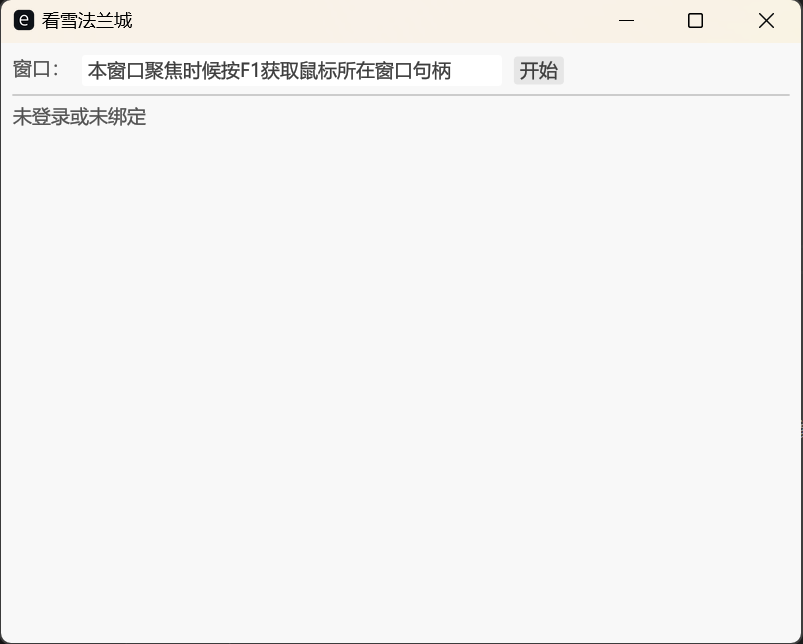
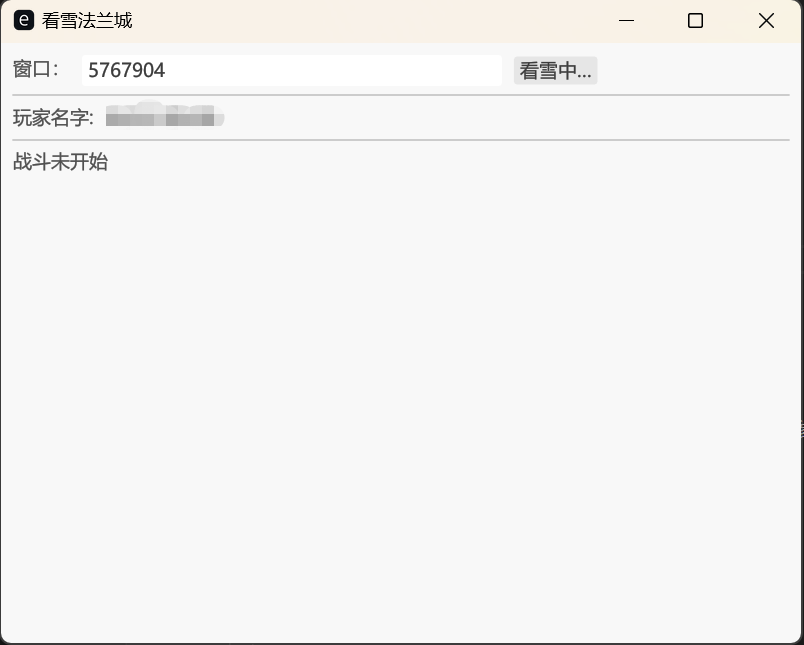
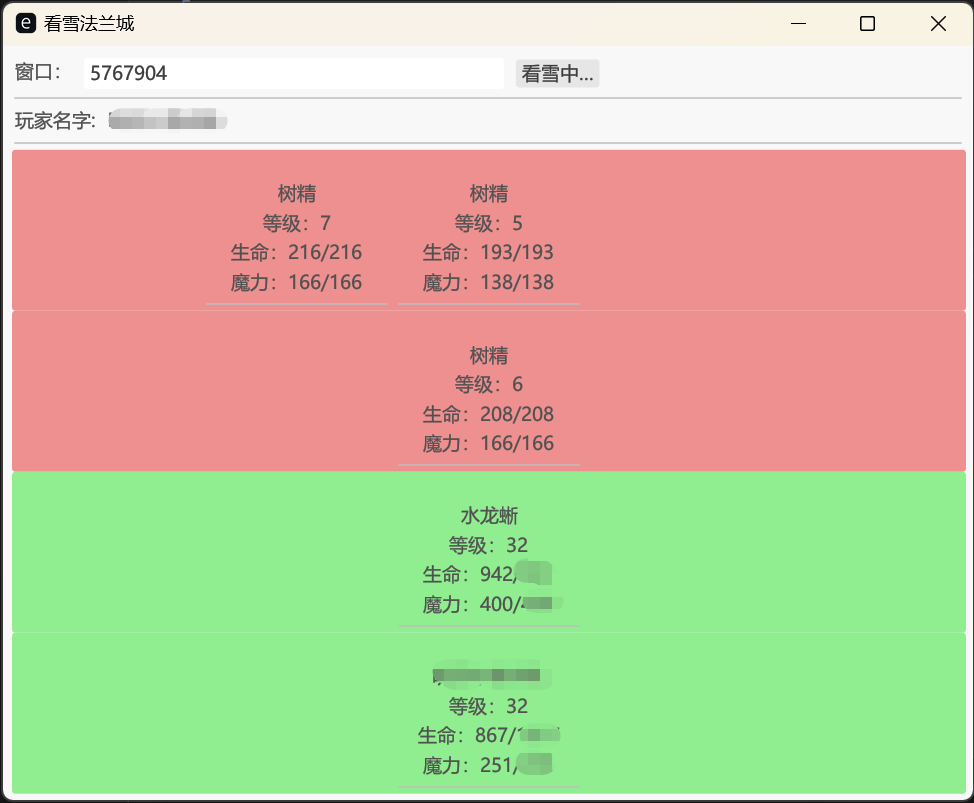

# 看雪法兰城


## 简介

Rust练手项目。

- egui/eframe
- config
- logger
- cc

## 编译

```
cargo build --release
```

## 配置

可选文件`config.json`放在和exe相同目录，可以调整一些参数：

```
{
  "ui": {
    "font": "c:/Windows/Fonts/msyh.ttc"
  },
  "memory_addr": {
    "name": "ECB8A8",
    "battle_info": "65B5DC",
    "battle_flag": "D3BEF4"
  }
}
```

以上内存地址请自行摸索。

## 截图




